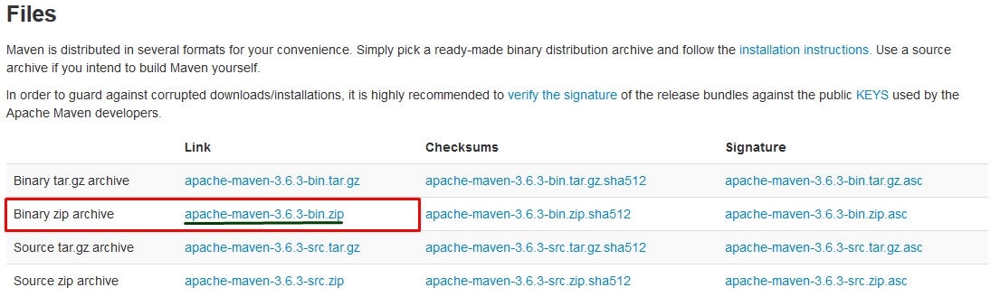

# I.Installing Maven

Navigate to the Maven [download](https://maven.apache.org/download.cgi) page ,navigate to the **Files** category and download the following:



Unzip it at preferred place ,mine will be:`C:\Program Files (x86)\apache-maven-3.6.3`

Setup the Windows **environmental variables.**You will need to add a new **System variable** and a **Path** variable:

**1.**Navigate to the Windows 10 **environment variables**

**2.**Under the **System variables** click the **New** and added the following value**:**

```text
Variable name: M2_HOME
Variable value: C:\Program Files (x86)\apache-maven-3.6.3
```

**3.**In the **System variables** you will see a variable named **Path** ,click her and click **Edit,** when the window is opened click **New** and add the following ****value**:**

```text
%M2_HOME%\bin
```

When you are done will all steps ,open a **Command Prompt** and type:

```bash
mvn -v
```

If everything is properlyset ,a response in this form will be received:

```bash
Apache Maven 3.6.3 (40f52333136460af0dc0d7232c0dc0bcf0d9e117; 2019-08-27T18:06:16+03:00)
Maven home: C:\Program Files (x86)\apache-maven-3.6.3\bin\..
Java version: 11.0.1, vendor: Oracle Corporation, runtime: C:\Program Files\Java\jdk-11.0.1
Default locale: en_US, platform encoding: Cp1252
OS name: "windows 10", version: "10.0", arch: "amd64", family: "windows"
```

