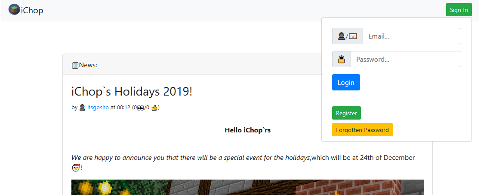
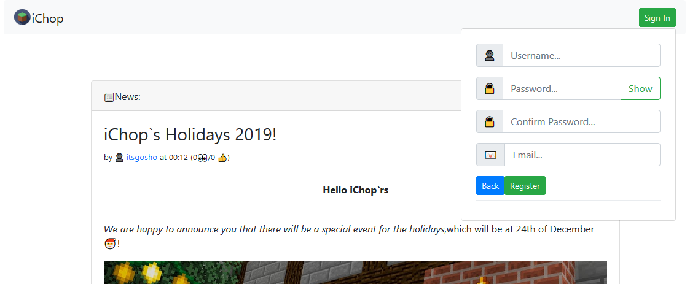
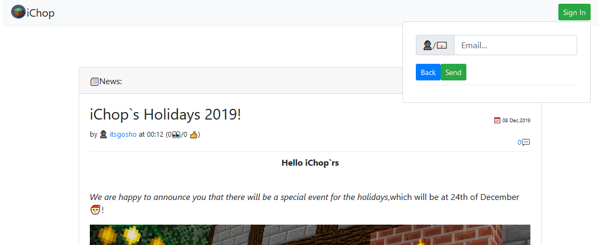

# Guest

The guest Navigation is way different than the other.When the **Sign In** is clicked

the login will appear as pretty **Dropdown** form

and next we can **Register** or **Reset our password**


Again we are using _Redux_ ,but this time to manage ,which form is shown to the User ,because the Component are separated with each other and we don't want to prop drill them :\)


