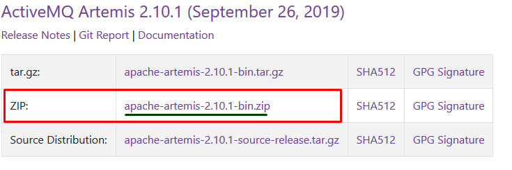

# II.Installing Artemis

Navigate to the ActiveMQ Artemis [download ](https://activemq.apache.org/components/artemis/download/)page and download the following:



After the download is finished unzip it somewhere and navigate to the **bin** folder.

Open a Command Prompt here and execute the following command:

```bash
artemis.cmd create --user 123 --password 123 --require-login iChop
```


The username and password are the same as the one in the properties of the microservices for the broker.


After you execute command a folder with the name **iChop** will appear ,that is where our broker is.

Navigation to **iChop/bin** and open again a **Command Prompt** and execute the following command:

```bash
artemis.cmd run
```


NOTE: If you have trouble with the Disk Usage ,navigate to the iChop/etc/broker.xml and set the max-disk-usage from 90 to 100.


