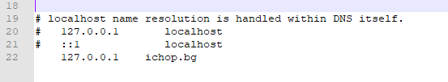

# IV.Configuring the Windows hosts

In order **Minecraft** to open a **web address** in the chat ,it must be a **domain name**.

Because ,we will run the project in local environment and the only easy solution that I have found to now is to proxy the **iChop.bg** domain to **127.0.0.1** ,which means that, when the given domain is open in the browser the DNS resolver will resolve him as [http://127.0.0.1/](http://127.0.0.1/) ,which is localhost.

Navigate to  _`C:\Windows\System32\Drivers\etc`_ and open __**hosts** file and add the following line `127.0.0.1 ichop.bg`:

